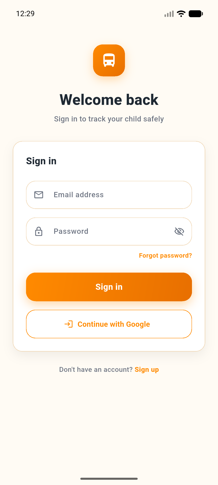
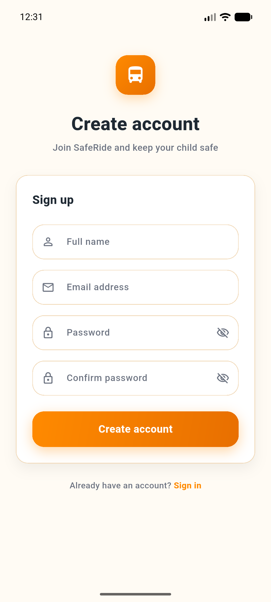
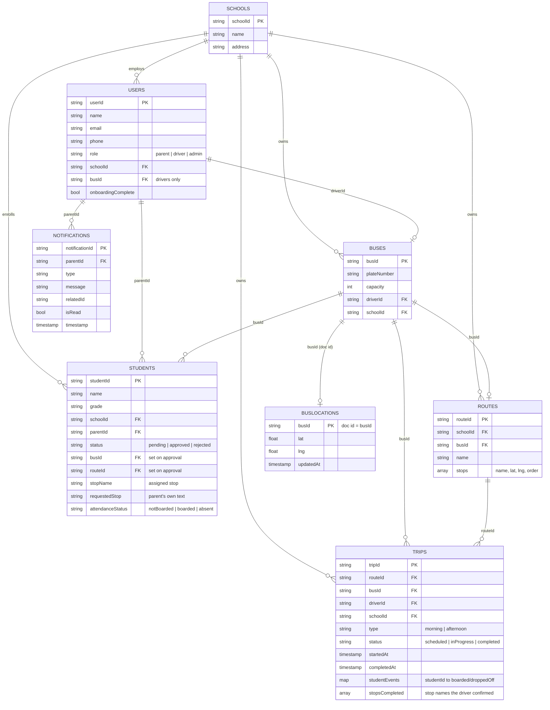

# SafeRide 🚌

Real-time school bus tracking and safety notifications for parents, drivers, and school administrators — built with Flutter and Firebase, entirely on the free (Spark) plan.

<p align="center">
  
  &nbsp;&nbsp;
  
</p>

---

## 🎥 Video Demo & Firebase Console

- **Watch the 10-15 minute walk-through on YouTube:** [SafeRide App Demo Video](https://www.youtube.com/watch?v=19jen9PldAw)
- **Firebase Firestore Console:** [SafeRide Firestore Database](https://console.firebase.google.com/project/safe-ride-b6af5/firestore/databases/-default-/data)

---

## Overview

SafeRide connects three roles on one platform so every child's school commute is safe and transparent:

- **Parents** register their children, request a pickup stop, and track the bus live from pickup to drop-off.
- **Drivers** run their daily route, mark students boarded/dropped-off, confirm each stop as passed, and broadcast live GPS.
- **School admins** approve pending students, assign them to a bus/route/stop, manage the driver and bus roster, and see a live activity feed.
- **Super admin** (single hardcoded account) provisions new schools and their first admin — the only piece of the system that spans more than one school.

There is no backend server or Cloud Functions anywhere in this project — every read/write goes directly from the Flutter app to Firestore, gated entirely by [Firestore Security Rules](#security-rules). This is a deliberate constraint to stay on Firebase's free Spark plan.

---

## Features by role

### Parent
- Onboarding: register one or more children, each with a requested pickup stop (a landmark, not a hard-coded bus stop — the admin matches it to a real stop during approval)
- Live status screen that auto-navigates once a child is approved (no manual refresh)
- Live trip tracking: current stop, next stop, ETA, and full route progress, computed from the driver's own stop confirmations (falls back to GPS-proximity estimation only when the driver hasn't confirmed a stop yet)
- Notification centre for boarding/drop-off, bus assigned, trip started/completed events
- Edit child details, add additional children after approval

### Driver
- Today's Route screen: ordered stop list, live GPS status, "Mark stop passed" per stop (distinct from and preferred over automatic GPS-proximity detection)
- Student roster scoped to their own assigned bus, boarding/absent marking with offline queue + auto-sync on reconnect (Hive-backed)
- Trip lifecycle: start/end trip, resumes an already-in-progress trip instead of duplicating it
- Own profile (name, bus, route, license) resolved live from Firestore
- SOS button — UI only; not wired to a backend collection (out of scope per the original spec)

### Admin (school-scoped)
- Bottom navigation: **Buses**, **Drivers**, **Students**, **Routes**, **Profile** — Live Map and Trips are reached from Routes; Alerts and Reports from Profile
- Approve/reject pending students, matching the parent's requested stop to a real route stop, then assign bus + driver
- Create driver accounts directly from the app (no separate backend — uses a secondary, disposable `FirebaseApp` instance so the admin's own session is never disturbed)
- Manage buses and routes (CRUD), live map of all buses on the school's routes
- Live activity feed (pending approvals, trips started/completed, stops passed) — computed client-side from existing streams, not a separate written collection
- Notification bell with unread count, visible on every top-level screen

### Super admin
- Separate dashboard, gated by a hardcoded verified email (`SuperAdminConfig`) — see [Security rules](#security-rules) for why
- Create schools and provision each school's first admin account (same secondary-app pattern as driver creation)

---

## Tech stack

| Layer | Technology |
|---|---|
| Framework | Flutter (Dart ^3.12) |
| State management | Riverpod 3 (`StreamProvider`, `AsyncNotifier`, `Notifier` — no `setState` for app state) |
| Backend | Firebase Auth + Cloud Firestore (Spark/free plan — no Cloud Functions, no Admin SDK) |
| Maps | `flutter_map` + OpenStreetMap (not Google Maps — avoids requiring a billing account) |
| Offline cache | Hive (driver attendance queue) |
| Local notifications | `flutter_local_notifications` (client-side, triggered by diffing Firestore streams — no FCM/push) |
| Connectivity | `connectivity_plus` |
| Preferences | `shared_preferences` (last signed-in email, login state) |
| Charts | `fl_chart` |

---

## Architecture

Feature-first Clean Architecture — every feature is split into `data / domain / presentation` layers:

```
lib/
├── core/                     # Firebase config, routing, theme, shared services
├── features/
│   ├── auth/                 # Login, register, forgot password, email verification
│   │   ├── data/              #   repository implementations, Firebase calls
│   │   ├── domain/            #   entities, repository interfaces
│   │   └── presentation/      #   screens, Riverpod providers
│   ├── parent/                # Onboarding, live tracking, notifications
│   ├── driver/                 # Route, attendance, trip lifecycle, SOS
│   ├── admin/                  # Approvals, fleet, routes, drivers, reports
│   └── super_admin/            # Cross-school provisioning
├── shared/                    # Cross-feature models (Student/Trip/Route/User/BusLocation entities), utils
└── main.dart
```

Business logic lives in `data`/`domain` repositories and Riverpod providers — screens (`presentation`) only read state and call provider methods, never talk to Firestore directly.

---

## Firebase data model

Eight top-level Firestore collections, no nested subcollections in the current model (everything is flat and queried by a `schoolId`/`busId`/`parentId` filter):



This diagram is generated straight from the field names actually written/read in the repository layer (`lib/features/*/data/repositories/`) and from [firestore.rules](firestore.rules) — see the sections below for the file-by-file mapping.

---

## Security rules

Full rules: [firestore.rules](firestore.rules). Summary of the access model:

- **No custom claims, no backend** — since there's no Cloud Functions/Admin SDK on Spark, every rule reads the caller's *own* `users/{uid}` document via `get()` to learn their `role`/`schoolId`/`busId`. This costs one extra document read per rule evaluation, which is the accepted tradeoff for staying on the free plan.
- **`schools`** — readable by any signed-in user (parents need the list during onboarding); writable only by the super admin or that school's own admin.
- **`users`** — everyone can read/update their own doc; an admin can additionally read/update accounts within their own school (needed to manage the driver roster).
- **`students`** — a parent can only create/read/update their *own* child; an admin can manage any student in *their own school*; a driver can only flip the `attendanceStatus` field (nothing else) for a student on *their own bus*.
- **`routes` / `buses`** — school-scoped read for any signed-in user in that school; write access restricted to that school's admin.
- **`trips`** — created/updated only by the assigned driver; read by anyone in the same school (admin dashboards, the driver, and parents whose child rides that bus).
- **`busLocations`** — written only by the driver of that specific bus; read by anyone in the same school as that bus (verified via a `get()` on the `buses` doc).
- **`notifications`** — each record is scoped to the owning parent; nothing is ever deleted from the client.

**Important query constraint we hit and fixed during development**: Firestore rejects a *list* query outright if its `.where()` filters don't structurally match the fields the rule checks — filtering only by `busId` when the rule checks `schoolId` returns `PERMISSION_DENIED`, even though every actual matching document would satisfy the rule. Every multi-field query in the driver/parent repositories filters on all the fields the applicable rule branch checks, for exactly this reason.

Deploy rules with:
```bash
firebase deploy --only firestore:rules
```

---

## Authentication

Two methods, both via Firebase Auth:
- **Email/password** — with email verification required before a parent can use the app (drivers/admins are provisioned by an admin/super admin and skip this gate)
- **Google Sign-In**

Driver and admin accounts are never self-registered — they're created by an admin/super admin using a secondary, disposable `FirebaseApp` instance, so creating a new account never signs the creator out of their own session.

---

## Getting started

### Prerequisites
- Flutter SDK ≥ 3.12
- A Firebase project with **Authentication** (Email/Password + Google providers enabled) and **Firestore** enabled
- **JDK 17 or newer** for Gradle — point Flutter at Android Studio's bundled JDK if you don't have one on `PATH`:
  ```bash
  flutter config --jdk-dir="C:\Program Files\Android\Android Studio\jbr"
  ```
- **Android NDK** installed (Android Studio → SDK Manager → SDK Tools → NDK (Side by side)) — required by a transitive plugin dependency (`path_provider_android`) even though this project doesn't use native code directly

### Setup

```bash
# 1. Clone the repo
git clone <repo-url>
cd safe_ride_app

# 2. Install dependencies
flutter pub get

# 3. Add your Firebase config
#    - Android: android/app/google-services.json
#    - iOS:     ios/Runner/GoogleService-Info.plist
#    Or regenerate both with: flutterfire configure

# 4. Deploy security rules to your project
firebase deploy --only firestore:rules

# 5. Run the app on a device or emulator
flutter run
```


### Seeding your first school

There's no seed script — the flow mirrors production:
1. Register a super admin account with the email configured in `lib/core/config/super_admin_config.dart`.
2. Sign in as the super admin and create a school + its first admin.
3. Sign in as that admin to create buses, routes, and drivers.
4. Register as a parent, pick the school, and submit a child for approval.

---

## Running tests

```bash
flutter test
```

Tests live under `test/features/`, organised by feature, and include both widget tests and unit tests against `fake_cloud_firestore` (no live Firebase project needed to run the suite).

---

## Known limitations

- SOS/emergency alert is UI-only — not wired to a Firestore collection (explicitly out of scope for the original spec).
- Notifications are local-only (`flutter_local_notifications`, triggered by diffing Firestore streams client-side) — there is no push notification support (would require Cloud Functions / FCM, which needs the Blaze plan).
- ETA and ETA-based stop status are a straight-line (haversine) estimate, not turn-by-turn routing — there's no paid directions API in use.
- Reports & Analytics currently uses illustrative data rather than aggregating real trip history.
